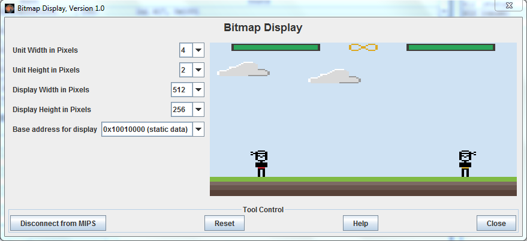

# Assembly
Arquitetura de Computadores - Pequeno game desenvolvido utilizando [Mars Mips Simulator](http://courses.missouristate.edu/kenvollmar/mars/index.htm)

#### Configurações para o [Mars Mips](http://courses.missouristate.edu/kenvollmar/mars/index.htm)

Unit width in pixel: 4

Unit height in pixel: 2

Display width in pixels: 512

Display height in pixels: 256

Base address for display 0x10010000 (static data)

#### Instruções 

- Jogador Esquerdo:

    W pula / E ataca

- Jogador da direita

    P pula / O ataca

#### Image

